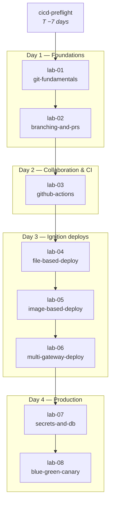

# Lab dependency graph

How the eight lab repos depend on each other, and where they map to course days.

## Reading the graph

- **Hard prerequisites** (solid arrows): the downstream lab assumes the upstream lab's outcomes. Skipping breaks the learner.
- **Day groupings** are facilitation boundaries, not hard dependencies — a participant who arrives mid-cohort can in principle parachute into a day if they've done the prerequisite labs.
- **`cicd-preflight`** is not a lab; it's a one-off environment validator. Learners run it ≥7 days before Day 1.

## Status (as of 2026-05-29)

| Lab | Repo exists | Notes |
|---|---|---|
| 01 | ✅ | Generic Python/Flask, no Ignition yet |
| 02 | ✅ | Builds on 01 |
| 03 | ✅ | First CI lab |
| 04 | ✅ | First Ignition lab (Docker, three gateways) |
| 05 | ❌ | Not yet created |
| 06 | ❌ | Not yet created |
| 07 | ❌ | Not yet created |
| 08 | ❌ | Not yet created |

Track creation in [`content-backlog.md`](./content-backlog.md).
